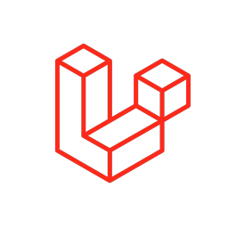

<h1 align="center">
  Carlos Arturo MT 
  <h4 align="center">Frontend Developer.</h4>
   
</h1>

## About Me

Since 2020 when I was a simple knowledge's lover, I found a way to create a lot of things with my own hands, my fingers, brain and creativity. I tried to build projects of Frontend, after that: Backend. In this moment of my life I continue learning every day to be a great developer. 

> **In addition to**
> currently I am a Frontend Developer in a International Corporative.

## Languages and Technologies

I  have worked with this technologies:

-  [JavaScript](https://developer.mozilla.org/es/docs/Web/JavaScript)
-  [React](https://legacy.reactjs.org/docs/getting-started.html)
-  [PHP](https://www.php.net/)
-  [Laravel](https://laravel.com/)
-  [Tailwind](https://tailwindcss.com/)
-  [Sass](https://sass-lang.com/documentation/)
- If you want to know me a little more clic [here](https://camtlead.com/)

## Tools and More

I  have worked with this tools:

-  [Firebase](https://firebase.google.com/?hl=es)
-  [Git](https://git-scm.com/)
-  [npm](https://www.npmjs.com/)

- If you want to know me a little more clic [here](https://camtlead.com/)

---

> [carlosarturomt@gmail.com](https://camtlead.com/) &nbsp;&middot;&nbsp;
> GitHub [@carlosarturomt](https://github.com/carlosarturomt) &nbsp;&middot;&nbsp;
